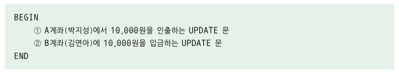

## Transaction
- DBMS 에서 데이터를 다루는 논리적인 작업의 단위
- 데이터베이스의 무결성을 유지하기 위해 원자성, 일관성, 고립성, 지속성의 성질을 갖는다.

### Transaction 의 목적
- 데이터베이스에서 데이터를 다룰 때 장애가 일어날 경우 데이터를 복구하는 작업의 단위가 된다.
- 데이터베이스에서 트랜잭션은 작업 단위를 분리하는 기준이 된다.
  - 트랜잭션 내의 작업들은 전체가 수행되거나 또는 전체가 수행되지 않아야 한다.
      
    *해당 은행 계좌이체는 모두 성공하거나 또는 모두 실패해야한다.*

### Transaction 수행
```sql
START TRANSACTION 
    -- 트랜잭션 내에서 수행할 작업
COMMIT
```

### Transaction 의 성질
- 원자성
  - 트랜잭션에 포함된 작업은 전부 수행되거나 아니면 전부 수행되지 않아야 한다.
  - 트랜잭션 중간에 작업이 잘못될 경우 회복 알고리즘을 이용하여 변경한 내용을 취소한다.
    - ROLLBACK 을 수행
- 일관성
  - 트랜잭션은 데이터베이스의 일관성을 유지해야 한다.
    - 계좌 이체의 경우 인출한 계좌의 입금한 계좌의 금액 총합이 이전과 이후가 동일해야 함
- 고립성
  - 여러 트랜잭션이 동시에 수행될 때 각 트랜잭션은 다른 트랜잭션의 방해를 받지 않고 독립적으로 수행된다.
- 지속성
  - 트랜잭션이 정상적으로 완료 혹은 부분완료한 데이터는 반드시 데이터베이스에 기록되어야 한다.
  - DBMS 의 복구 시스템은 트랜잭션이 작업한 내용을 수시로 로그 데이터베이스에 기록하였다가 문제가 발생하면
  로그 파일을 이용하여 복구 작업을 수행