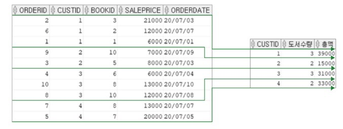
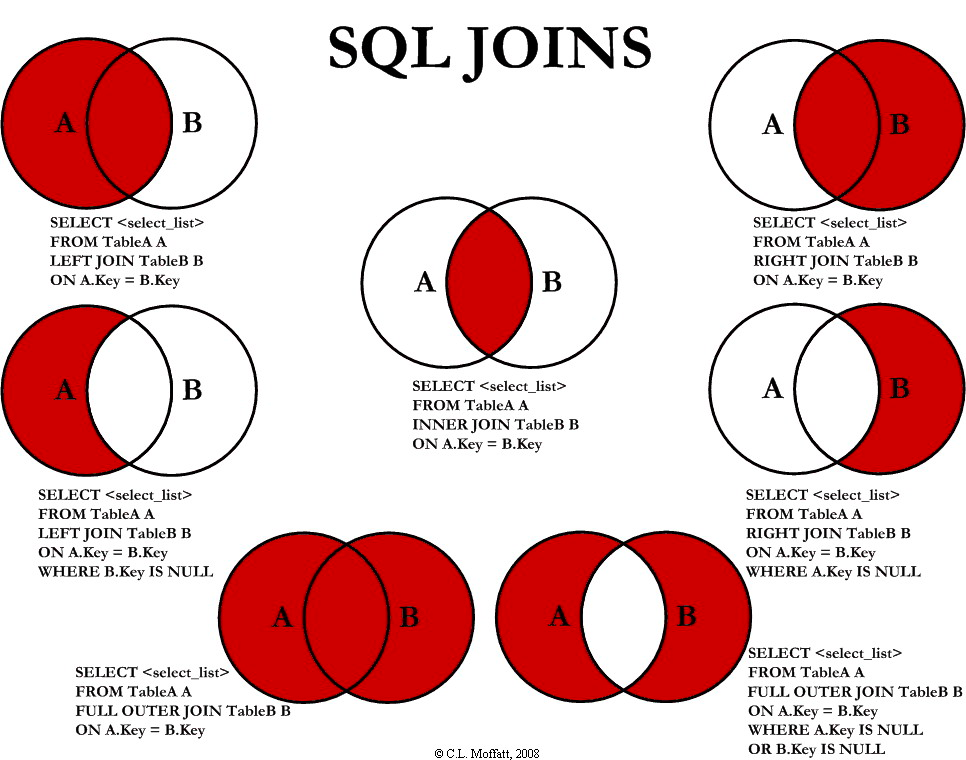
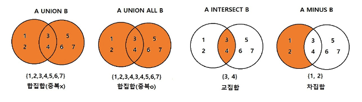
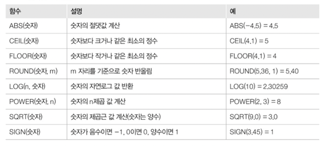
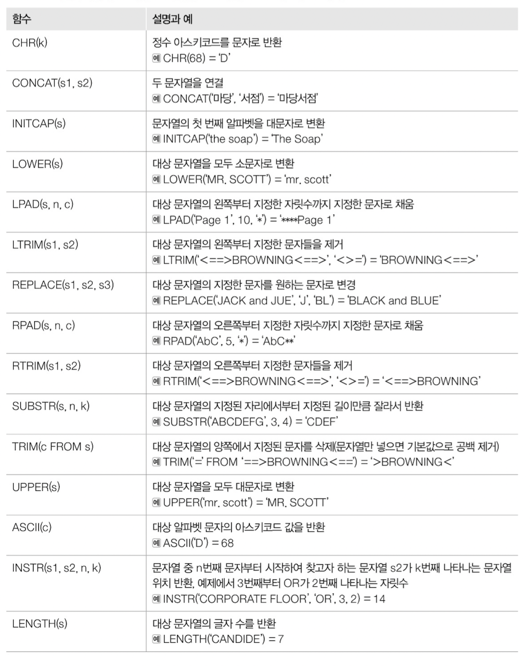
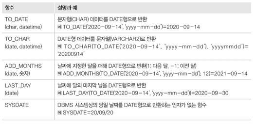
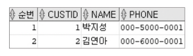

## DML - Data Manipulation Language
- 데이터 조작어. 테이블에 데이터를 검색, 삽입, 수정, 삭제하는 데 사용

<details>
<summary style="font-size: x-large; font-weight: 600;">SELECT</summary>

### SELECT
- 데이터를 검색하는 기본 문장. 특별히 질의어(Query) 라고 부른다.
- 검색한 결과를 테이블 형태로 출력
    ```sql
    SELECT      email
    FROM        member;
    ```
  
### WHERE
- 조건에 맞는 검색을 할 때 사용
- 조건으로 사용하는 술어는 비교, 범위, 집합, 패턴, NULL 이 있다.
  - 비교
    - =, <>, <, <=, >, >=
  - 범위
    - BETWEEN
  - 집합
    - IN, NOT IN
  - 패턴
    - LIKE
  - NULL
    - IS NULL, IS NOT NULL
  - 복합 조건
    - AND, OR, NOT
  ```sql
    SELECT      email
    FROM        member
    WHERE       email LIKE '%ruby%';
    AND         salary BETWEEN 100000 AND 200000
    AND         IN (BACKEND, FRONTEND)
    AND         NOT salary = 150000;
  ```

### ORDER BY
- SQL 문의 실행 결과를 특정 기준으로 정렬하여 출력할 때 사용
- 기본적으로 오름차순으로 정렬하며 내림차순으로 정렬 시에는 DESC 키워드를 사용
    ```sql
    -- 오름차순 조회시
    SELECT      email
    FROM        member
    ORDER BY    salary;
  
    -- 내림차순 조회시
    SELECT      email
    FROM        member
    ORDER BY    salary DESC;
    ```

### 집계(통계) 함수
- 여러 행으로부터 하나의 결과값을 반환하는 함수
- SELECT 구문에서만 사용됨
- 주로 평균, 합, 최대, 최소 등을 구하는 데 사용됨
  - COUNT
    - 지정한 컬럼(여러 컬럼 지정 가능)의 값이 NULL 이 아닌 행의 개수를 세는 집계함수.
  - SUM
    - 지정한 컬럼의 값의 총 합을 구하는 집계함수
  - AVG
    - 지정한 컬럼(여러 컬럼 지정 가능)의 값이 NULL 이 아닌 값들의 평균을 구하는 집계함수
  - MIN
    - 지정한 컬럼의 값들 중 최소값을 구하는 집계함수
  - MAX
    - 지정한 컬럼의 값들 중 최대값을 구하는 집계함수
  ```sql
  SELECT    SUM(saleprice) AS Total,
            AVG(saleprice) AS Average,
            MIN(saleprice) AS Mininum,
            MAX(saleprice) AS Maximum
  FROM      Orders;
  
  -- 판매 기록 수를 조회
    SELECT    COUNT(*)
    FROM      Orders;
    
    -- 중복을 제외한, 구매자 수를 조회
    SELECT    COUNT(DISRINCT shoper)
    FROM      Orders;
  ```
  
### GROUP BY
- 같은 속성 값끼리 그룹화할 때 사용
- 그룹화 한 결과의 SELECT 절에는 GROUP BY 에서 명시한 속성과 집계함수만 사용할 수 있다.
  ```sql
  SELECT      custid, COUNT(*) AS 판매수량, SUM(saleprice) AS 총 판매액
  FROM        Orders
  GROUP BY    custid;
  ```  
    
  *그룹화 전과 그룹화 후의 결과 비교*  

### HAVING
- GROUP BY 로 그룹화한 그룹을 제한하여 조회할 때 사용
  1. WHERE 절에 작성한 결과를 GROUP BY 절로 그룹화
  2. 1의 결과에서 HAVING 조건애 해댱하는 결과를 최종 결과로 출력
  ```sql
                                                -- 실행 순서
  SELECT      custid, COUNT(*) AS 도서수량        -- 5
  FROM        Orders                            -- 1
  WHERE       saleprice >= 8000                 -- 2
  GROUP BY    custid                            -- 3
  HAVING      COUNT(*) >= 2                     -- 4
  ORDER BY    custid;                           -- 6
  ```
</details>


<details>
<summary style="font-size: x-large; font-weight: 600;">JOIN</summary>

## JOIN
- 여러 테이블을 연결하여 결합하는 연산
- 조인을 통한 조회 결과 역시 테이블의 형태로 GROUP BY, ORDER BY 등을 적용할 수 있다.
  ```sql
                                                    -- 실행 순서
  SELECT    name, SUM(saleprice)                    -- 5
  FROM      Customer, Orders                        -- 1
  WHERE     Customer.custid = Orders.custid         -- 2
  GROUP BY  Customer.name                           -- 3
  ORDER BY  Customer.name                           -- 4
  ```

### Cartesian Product
- 조인된 테이블 간의 결합으로 발생할 수 있는 모든 경우를 출력하는 연산
  - 조인된 결과가 연관관계에 맞지 않는 경우까지 포함
- 테이블을 조인할 때 별도의 조건을 걸지 않을 경우에 발생
  - 대부분 실무에서 Cartesian Product 의 결과를 조회하는 일은 거의 없다.

### JOIN 문법


- 내부 조인
  ```sql
  SELECT        속성들
  FROM          table1 , table2
  WHERE         조인 조건
  AND           검색 조건
  
  SELECT        속성들
  FROM          table1
  INNER JOIN    table2
  ON            조인 조건
  WHERE         검색 조건
  AND           검색 조건
  ```

- 외부 조인
  ```sql
  SELECT                                속성들
  FROM                                  table1
  [LEFT | RIGHT | FULL] OUTER JOIN      table2
  ON                                    조인 조건
  WHERE                                 검색 조건
  AND                                   검색 조건
  ```

</details>


<details>
<summary style="font-size: x-large; font-weight: 600;">Sub Query - 부속질의</summary>

### Sub Query
- 부속질의. SQL 문 내에 또 다른 SQL 문을 작성
- 조회 결과를 또 다른 SQL 문에 활용하기 위해 사용
  - WHERE 절에 사용
    - WHERE 절에 사용되는 부속질의 결과가 동등, 크기 비교에 사용될 경우 부속질의 결과는 단일 값이어야 한다.
    ```sql
    SELECT  bookname
    FROM    Book
    WHERE   price = (
                        SELECT  MAX(price)
                        FROM    Book
                    );
    
    
    -- 부속질의가 있을 경우에는 하위 부속질의를 먼저 실행하고 그 결과를 이용하여 상위 부속질의를 실행
    -- 2
    SELECT  name
    FROM    Customer
    WHERE   custid IN (
                        -- 1
                        SELECT  custid
                        FROM    Orders
                    );
    ```

</details>


<details>
<summary style="font-size: x-large; font-weight: 600;">Set Operation - 집합연산</summary>

## Set Operation
- 집합연산. 두 개 이상의 테이블에서 조인을 사용하지 않고 연관된 데이터를 조회하는 방법  
  

### UNION
- 두 조회결과를 합한 하나의 결과를 조회
  - A UNION B
    - A 와 B 를 합한 결과를 중복을 제거하여 조회
  - A UNION ALL B
    - A 와 B 를 합한 결과를 중복을 제거하지 않고 조회
  ```sql
  -- Customer 와 team 에 있는 모든 이름을 중복을 제거하여 조회
  SELECT    name
  FROM      Customer
  UNION
  SELECT    name
  FROM      team
  
  -- Customer 와 team 에 있는 모든 이름을 중복을 제거하지 않고 조회
  SELECT    name
  FROM      Customer
  UNION ALL
  SELECT    name
  FROM      team
  ```

### INTERSECT
- 두 조회결과에 모두 존재하는 행들을 조회
  ```sql
  -- Customer 와 team 양쪽에 모두 존재하는 이름을 조회
  SELECT    name
  FROM      Customer
  INTERSECT
  SELECT    name
  FROM      team
  ```

### MINUS
- 반대쪽 결과에 존재하지 않는 행들을 조회
  ```sql
  -- Customer 에 있는 이름들 중 team 에 없는 이름을 조회
  SELECT    name
  FROM      Customer
  MINUS
  SELECT    name
  FROM      team
  ```

### EXISTS
- 부속질의의 결과의 행이 존재하는 조건을 만족하는 메인질의의 행을 결과에 포함하여 조회
  ```sql
  -- 주문내역이 있는 고객의 이름과 주소를 조회
                                                            -- 실행 순서
  SELECT    name, address                                   -- 3
  FROM      Customer cs                                     -- 1
  WHERE     EXISTS (                                        -- 2 (1의 모든 행에 대하여 부속질의를 확인)
                        SELECT  *
                        FROM    Orders od
                        WHERE   cs.custid = od.custid
                    );
  ```
</details>


<details>
<summary style="font-size: x-large; font-weight: 600;">INSERT</summary>

### INSERT
- 테이블에 새로운 튜플을 삽입하는 명령어
  ```sql
  INSERT INTO   MEMBER(name, email)             -- 컬럼을 지정하지 않을 경우 values 에 모든 컬럼을 값을 넣어주어야 한다.
  VALUES        ('ruby', 'ruby@gmail.com');
  ```

</details>


<details>
<summary style="font-size: x-large; font-weight: 600;">UPDATE</summary>

### UPDATE
- 특정 속성값을 수정하는 명령어
  ```sql
  UPDATE    MEMBER
  SET       name = 'diamond', email = 'diamond@gmail.com'
  WHERE     id = 1;
  -- 조건을 걸지 않으면 테이블의 모든 행을 대상으로 속성을 변경하므로 주의해야한다.
  -- 특정 한 행의 속성을 변경할 때에는 조건에 PK, Unique 값을 조건으로 걸어준다.
  ```

</details>


<details>
<summary style="font-size: x-large; font-weight: 600;">DELETE</summary>

### DELETE
- 테이블의 기존 튜플을 삭제하는 명령어
  ```sql
  DELETE
  FROM      MEMBER
  WHERE     id = 1;
  -- 조건을 걸지 않으면 테이블의 모든 행을 삭제하므로 주의해야한다.
  -- 특정 한 행의 속성을 삭제할 때에는 조건에 PK, Unique 값을 조건으로 걸어준다.
  ```

</details>


<details>
<summary style="font-size: x-large; font-weight: 600;">STORED FUNCTION - 내장함수</summary>

## STORED FUNCTION
- 상수나 속성 이름을 입력값으로 받아 단일 값을 결과로 반환하는 함수

### 숫자 관련 내장 함수
  
```sql
-- 숫자 대신 숫자 값을 가지는 열이름을 사용할 수도 있다.
SELECT      ABS(-5),                -- 5
            ROUND(124.56, 1),       -- 124,6
            ROUND(1245000, -3),     -- 1250000
            CEIL(124.56),           -- 124
            POWER(2, 3),            -- 8
            SQRT(9),                -- 3
            SIGN(14),               -- 1
            SIGN(-14),              -- -1
            SIGN(0),                -- 0
            LOG(10)                 -- 2.30259
FROM        DUAL;
```

### 문자 함수
  
```sql
SELECT      REPLACE('플루트는 관약기', '플루트', '클라리넷'),          -- 클라리넷는 관약기
            LENGTH('플루트'),                                    -- 3
            SUBSTR('플루트는 관약기', 1, 6),                       -- 플루트는 관. 두번째 인자는 시작 위치(1부터 시작), 세번째 인자는 길이
            LOWER('FLUTE'),                                    -- flute 
            UPPER('flute'),                                    -- FLUTE
            LPAD('page 1', 10, '*'),                            -- ****page 1
            RPAD('page 1', 10, '*'),                            -- page 1****
FROM        DUAL;
```

### 날짜 / 시간 함수
  
```sql
SELECT      TO_DATE('2023-01-30', 'yyyy-mm-dd'),                            -- 2023-01-30
            TO_CHAR(TO_DATE('2023-01-30', 'yyyy-mm-dd'), 'yyyymmdd'),       -- '20230130'
FROM        DUAL;
```
</details>


<details>
<summary style="font-size: x-large; font-weight: 600;">ROWNUM</summary>

### ROWNUM
- 오라클 내부적으로 생성되는 가상 컬럼
- 조회 결과의 순번을 나타냄 (1번 부터 시작)
```sql
SELECT      ROWNUM AS '순번', custid, name, phone
FROM        CUSTOMER
WHERE       ROWNUM <= 2;
```


</details>