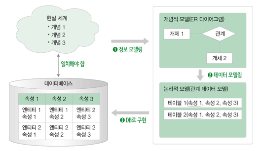
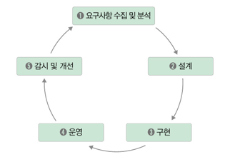
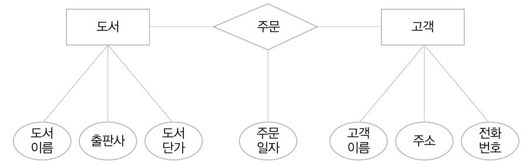
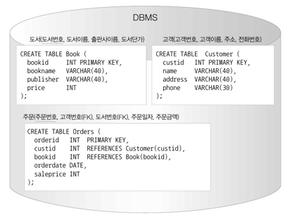

## Data Modeling - 데이터베이스 설계
- 현실 세계의 복잡한 개념을 단순화하고 추상화시켜 데이터베이스화하는 과정  
  

### 데이터베이스 생명주기  
  
1. 요구사항 수집 및 분석
   - 사용자들의 요구사항을 듣고 분석하여 데이터베이스 구축의 범위를 정하는 단계
2. 설계
   - 분석된 요구사항을 기초로 주요 개념과 업무 프로세스 등을 식별하고, 사용하는 DBMS 의 종류에 맞게 변환한 후,
   데이터베이스 스키마를 도출
   - 개념적 모델링
       
     - 요구사항을 수집하고 분석한 결과를 토대로 업무를 핵심적인 개념을 구분하고 전체적인 뼈대를 만드는 과정
     - 개체를 추출하고 각 개체 간의 관계를 정의하여 ERD 를 만드는 과정   
   - 논리적 모델링
       
     - 개념적 모델링에서 만든 ERD 를 사용하고자 하는 DBMS 에 맞게 매핑하여 실제 데이터베이스로 구현하기 위한
     모델을 만드는 과정
     - 실제 필요한 모든 속성을 추출
     - 정규화 수행
     - 데이터 용어 사전과 도메인을 정의하여 동일하게 사용되는 용어를 정리하고 데이터의 형태 및 크기를 확정
   - 물리적 모델링
      
     - 작성된 논리적 모델을 실제 컴퓨터 저장 장치에 저장하기 위해 데이터 타입과 길이 등 물리적 구조를 정의하고 구현하는 과정
     - 응답 시간을 최소화하도록 구현
     - 트랜잭션을 효율적으로 분산시킬 수 있는 전략을 구상
     - 데이터가 저장될 공간을 효율적으로 배치
3. 구현
   - 설계 단계에서 생성한 스키마를 실제 DBMS 에 적용하여 테이블 및 관련 객체(뷰, 인덱스 등)를 생성
   - 관련 소프트웨어(웹 서버 등)에 설계한 데이터베이스를 적용하여 서비스를 제공할 수 있도록 프로그램을 완성
4. 운영
   - 구현된 데이터베이스를 기반으로 소프트웨어를 구축하여 서비스를 제공
5. 감시 및 개선
   - 데이터베이스 운영에 따른 시스템의 문제를 지속적으로 관찰하고 데이터베이스 자체의 문제점을 파악하여 개선
   - 데이터베이스가 지속적으로 운영될 수 있도록 변경 및 유지보수