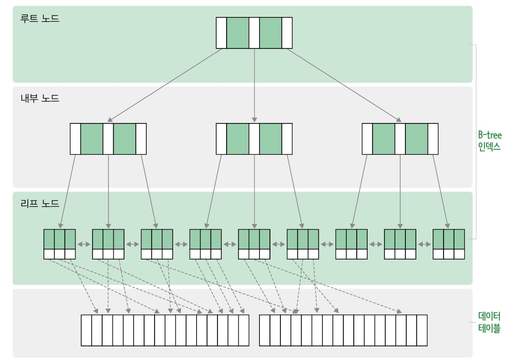
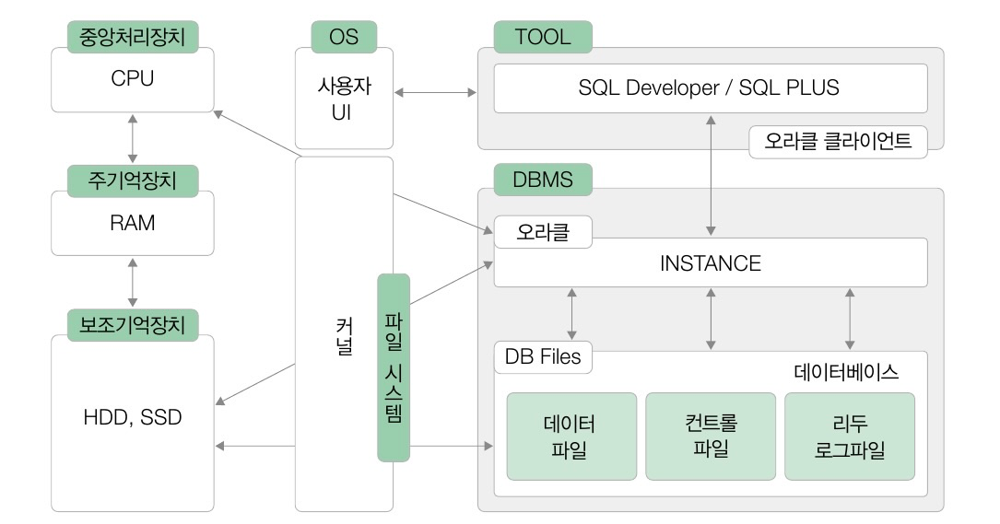

## INDEX
- 원하는 데이터를 빠르게 찾기 위해 튜플의 키값에 대한 물리적 위치를 기록해 둔 자료구조
- 일반적으로 RDBMS 의 인덱스는 대부분 B-Tree 구조로 되어 있다.
  - B-Tree
    - 데이터의 검색 시간을 단축하기 위한 트리형 자료구조 중에서도 양쪽이 균형있게 배치된 구조 
          
        *B-Tree 의 각 노드는 키값과 포인터를 가진다.*
    - 데이터의 삽입, 수정, 삭제 등으로 인하여 변경이 발생하면 재구성이 필요함
    - 인덱스는 결국 데이터가 물리적으로 위치한 주소를 빠르게 찾을 수 있도록 B-Tree 를 생성하여 제공해주는 것이다.
- 테이블에서 한 개 이상의 속성을 이용하여 생성

### 데이터 베이스의 물리적 저장  

- 실제 데이터는 보조기억장치(SSD, 하드디스크 등)에 저장된다.
- 보조기억장치에서 데이터를 저장하고 읽을 때에는 RAM 보다 느리기 때문에 DBMS 가 사용하는 공간중 일부를
DB 버퍼 캐시로 만들어 자주 사용하는 데이터를 저장하고 관리한다.
- DBMS 는 데이터베이스별로 하나 이상의 데이터 파일을 생성한다.

### 인덱스의 생성
```sql
-- Book 테이블의 bookname 열을 대상으로 인덱스 idx_Book 를 생성
CREATE INDEX idx_Book ON Book (bookname);
```
- 인덱스는 데이터 검색을 빠르게 하기 위해 생성하고 사용하지만 무조건 데이터 검색이 빨라지는 것은 아니다.
  - 인덱스로부터 물리적 주소를 찾기위해 B-Tree 를 탐색하지만 데이터 양이 별로 없거나 선택도가 높으면 인덱스가 없는 것이
    더 빠를 수 있다.
    - 선택도
      - 1 / 서로 다른 값의 개수
      - 경우의 수가 적을 수록 선택도가 크다.
      - 선택도가 크다면 굳이 B-Tree 를 통해 탐색할 필요없이 금방 찾을 수 있기 때문이다.
- 인덱스 생성시 고려사항
  - WHERE 절 또는 JOIN 에 자주 사용되는 속성이어야 한다.
  - 단일 테이블에 인덱스가 많으면 속도가 느려질 수 있다.
    - 테이블당 최대 4~5개 정도 권장
  - 속성(컬럼)이 가공되는 경우 사용하지 않는다.
  - 속성이 선택도가 낮을 때 인덱스의 효과가 크다.

### 인덱스 재구성
```sql
-- 인덱스 idx_Book 를 재구성
ALTER INDEX idx_Book REBUILD;
```
- B-Tree 인덱스는 데이터의 삽입, 수정, 삭제가 잦으면 노드의 갱신이 주기적으로 일어나 단편화 현상이 발생하는데
이를 기존 인덱스를 버리고 다시 재구성하여 해결할 수 있다.
  - 단편화
    - 삭제된 레코드의 인덱스 값 자리가 빈 상태가 되는 것. 해당 빈 공간이 메모리 곳곳에 발생하고 이를 활용하지 못한 상태로 방치되면
    컴퓨터 성능에 문제가 발생할 수 있다.

### 인덱스 삭제
```sql
-- 인덱스 idx_Book 를 삭제
DROP INDEX idx_Book;
```
- 테이블에 인덱스가 많으면 데이터베이스 성능에 좋지 않으므로 사용하지 않는 인덱스는 삭제해주는 것이 좋다.