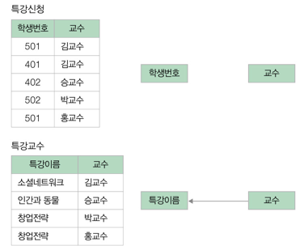

## 정규화
- 관계형 데이터베이스의 설계에서 중복을 최소화하게 데이터를 구조화하는 작업
- 이상현상이 발생하는 테이블을 수정하여 정상으로 만드는 과정

### 이상현상 - Anomaly
- 테이블에 튜플을 삽입할 때 부득이하게 NULL 값이 입력되거나, 삭제시 연쇄삭제 현상이 발생하거나,
수정 시 데이터의 일관성이 훼손되는 현상
- 이상현상의 종류  
      
    *이상현상을 없애기 위해서는 해당 테이블을 학생 테이블과 수강정보 테이블로 분리해야 한다.*
  - 삭제이상
    - 튜플 삭제 시 다른 정보까지 연쇄적으로 삭제되는 현상
  - 삽입이상
    - 튜픕 삽입 시 특정 속성에 해당하는 값이 없어 NULL 값을 입력해야 하는 현상
      - 위의 학생수강 테이블에서 학생 정보를 입력할 때 수강신청을 하지 않은 상태일 경우 NULL 값을 입력해야함
  - 수정이상
    - 튜플 수정 시 중복으로 저장된 데이터 일부만 수정되어 데이터의 불일치 문제가 일어나는 현상

### 정규화 과정
- 제 1 정규형
  - 릴레이션의 속성값을 원자값으로 분리하는 작업
      
    *속성값이 더 이상 쪼갤수 없는 원자값을 갖도록 분해*
- 제 2 정규형
  - 제 1 정규형안 릴레이션을 기본키가 아닌 속성이 기본키에 완전 함수 종속하도록 하는 작업
    - 완전 함수 종속
      - A와 B가 릴레이션 R의 속성이고 A -> B 종속성이 성립할 때, B가 A 의 속성 전체에 함수 종속하고 A의 부분집합 속성에
      함수 종속하지 않을 경우
        - 함수 종속
          - A와 B가 있을 때 A의 값을 알면 B의 값이 유일하게 정해지는 의존관계   

      
      
    *수강강좌 테이블을 수강, 강의실 테이블로 분리. 강의실은 강좌 이름에 따라 결정되는 함수 종속 관계이다.*
- 제 3 정규형
  - 릴레이션이 제 2 정규형이고 기본키가 아닌 속성이 기본키에 비이행적으로 종속(직접 종속)해야한다.
    - 이행적 종속
      - A -> B, B -> C 가 성립할 때, A -> C 가 성립, 즉 C가 A의 속성 전체에 함수 종속
      - 비이행적 종속은 B -> C 는 성립하지만 A -> C 는 성립하지 않는 경우
    
      
      
    *변경 전 수강료 속성은 학생번호 뿐만 아니라 기본키가 아닌 강좌이름에도 종속되어 있다.*
- BCNF 정규형
  - 릴레이션 R에서 함수 종속성 X -> Y 가 성립할 때, 모든 결정자 X가 후보키가 되도록 하는 작업  
      
      
    *특강수강 릴레이션의 결정자 중 학생번호, 특강이름은 후보키이지만 교수는 후보키가 아니다.
    그러나 특강이름은 교수에 의해 결정되므로 교수 속성은 결정자이다. 이처럼 결정자이면서 후보키가 아닌
    속성이 존재할 경우 이상현상이 발생할 경우 이를 BCNF 정규형 작업을 통해 해결한다.* 